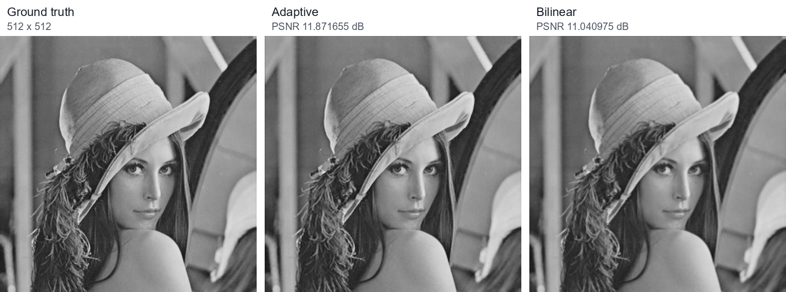

# Adaptive Image Interpolation

256×256 grayscale 영상을 512×512로 확대하기 위해 픽셀의 활동성과 방향성을 분류하고, 그룹별 7×7 보간 필터를 최소제곱법으로 구한 C 프로젝트입니다.

| 항목 | 내용 |
| --- | --- |
| 수업 | 수치해석 |
| 입력 / 출력 | YUV400 8-bit RAW, 256×256 → 512×512 |
| 구현 언어 | C |
| 개발 환경 | Visual Studio, Platform Toolset v143 |
| 비교 기준 | Bilinear interpolation, PSNR |

## Result Preview

위 이미지는 Lena 데이터에 대한 보고서 결과입니다. 확대 방식의 차이를 같은 크기로 비교하기 위해 원 보고서의 결과 이미지를 나란히 배치했습니다.

## Method

### 1. Activity and Direction Classification

수직·수평·두 대각선 방향의 7×7 필터 응답을 계산합니다. 활동성은 수직·수평 응답의 제곱합으로 정의했습니다.

$$
A(i,j)=R_V(i,j)^2+R_H(i,j)^2
$$

활동성 $A$는 Lloyd-Max 양자화를 100회 반복해 5단계로 나누고, 방향은 무방향·수직·수평·두 대각선의 5개 범주로 구분합니다. 따라서 최대 25개 픽셀 그룹을 만들며, 표본 수가 7×7 필터 계수보다 적은 그룹은 인접 활동성 그룹과 합칩니다.

### 2. Least-squares Filter Estimation

한 그룹의 7×7 이웃 픽셀을 행으로 쌓은 $N\times49$ 행렬을 $X$, 대응하는 ground-truth sub-pixel 값을 $Y$라고 둡니다. 필터 $F$는 다음 손실을 최소화하도록 계산합니다.

$$
L(F)=(Y-XF)^T(Y-XF)
$$

정규방정식은 다음과 같습니다.

$$
X^T X F=X^T Y, \quad F=(X^TX)^{-1}X^TY
$$

코드에서는 $X^TX$와 $X^TY$를 누적하고 Gauss-Jordan 소거법으로 49개 계수를 계산합니다. 원래 위치의 픽셀을 제외한 가로·세로·대각 sub-pixel 위치마다 필터를 하나씩 생성합니다.

### 3. Evaluation

$$
MSE=\frac{1}{MN}\sum_{i=1}^{M}\sum_{j=1}^{N}(I_{ij}-\hat I_{ij})^2
$$

$$
PSNR=10\log_{10}\frac{255^2}{MSE}
$$

## Reported Results

| 영상 | Adaptive | Bilinear | 차이 |
| --- | ---: | ---: | ---: |
| Lena | 11.871655 dB | 11.040975 dB | +0.830680 dB |
| Couple | 7.710498 dB | 7.449350 dB | +0.261148 dB |
| Barbara | 8.236774 dB | 7.364886 dB | +0.871888 dB |

세 데이터 모두 보고서의 PSNR에서는 adaptive 결과가 bilinear보다 높았습니다. 다만 필터는 입력 저해상도 영상과 해당 ground truth 쌍으로 학습합니다. 현재 `main.c`도 Barbara 경로가 직접 지정되어 있으므로, 다른 영상에 대한 일반화 성능을 검증한 구현은 아닙니다.

## Build and Run

1. [`AdaptiveInterpolation/AdaptiveInterpolation.sln`](./AdaptiveInterpolation/AdaptiveInterpolation.sln)을 Visual Studio에서 엽니다.
2. 작업 디렉터리를 `AdaptiveInterpolation/AdaptiveInterpolation`로 둡니다.
3. `main.c` 77~78행의 low-resolution / ground-truth 경로를 같은 영상 쌍으로 맞춥니다.
4. 실행하면 그룹별 필터가 `filter/`에, 512×512 결과가 `res.raw`에 기록되고 PSNR이 출력됩니다.

## Files

| 경로 | 설명 |
| --- | --- |
| [`main.c`](./AdaptiveInterpolation/AdaptiveInterpolation/main.c) | 분류, 필터 계산, 보간 전체 흐름 |
| [`methods.c`](./AdaptiveInterpolation/AdaptiveInterpolation/methods.c) | RAW I/O, convolution, Gauss-Jordan, PSNR 계산 |
| [`LMQuant.c`](./AdaptiveInterpolation/AdaptiveInterpolation/LMQuant.c) | Lloyd-Max 활동성 양자화 |
| [`NM-HW03-2019202053-ver1.pdf`](./NM-HW03-2019202053-ver1.pdf) | 설계 과정과 비교 결과 보고서 |
