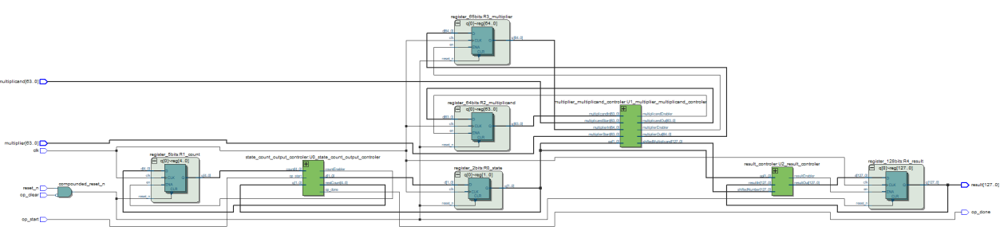
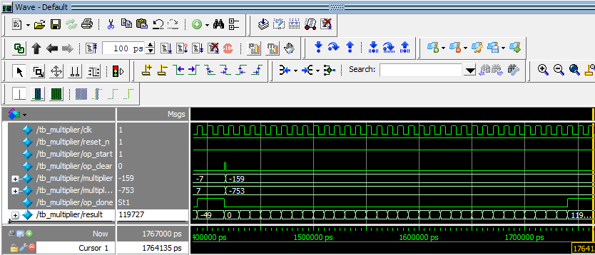

# 64-bit Radix-4 Booth Multiplier

두 개의 64-bit signed 정수를 받아 128-bit 곱셈 결과를 만드는 순차형 Radix-4 Booth multiplier를 Verilog HDL로 구현한 프로젝트입니다.

| 항목 | 내용 |
| --- | --- |
| 수업 | 2022학년도 컴퓨터공학기초실험2 |
| 입력 / 출력 | signed 64-bit × signed 64-bit → 128-bit |
| 도구 | Verilog HDL, Quartus Prime 15.1 |
| 대상 FPGA | Cyclone V `5CSXFC6D6F31C6` |

## Design

Radix-4 Booth encoding은 multiplier의 비트를 3개씩 확인하고 한 주기에 2 bit를 처리합니다.

| 비트 패턴 | 부분곱 |
| --- | ---: |
| `000`, `111` | 0 |
| `001`, `010` | +M |
| `011` | +2M |
| `100` | -2M |
| `101`, `110` | -M |

64-bit multiplier를 arithmetic right shift 2씩 이동하므로 계산 구간은 32회입니다. 제어부는 `IDLE` → `CALCULATING` → `DONE`의 세 상태로 구성했고, `op_clear` 또는 reset으로 다시 초기화합니다.

### Module Structure

- `multiplier.v`: top module과 register·controller 연결
- `state_count_output_controler.v`: FSM, 5-bit counter, `op_done` 생성
- `multiplier_multiplicand_controler.v`: Booth recoding, 부분곱, multiplier shift
- `result_controler.v`: 128-bit 누산 결과 갱신
- `resgisters.v`: 2/5/64/65/128-bit register 모듈
- `tb_multiplier*.v`: top 및 내부 신호 검증용 testbench

## Verification

보고서와 testbench에서 다음 입력을 확인했습니다.

| 입력 | 기대 결과 | 시뮬레이션 결과 |
| --- | ---: | ---: |
| 7 × -7 | -49 | -49 |
| 945 × 1,234 | 1,166,130 | 1,166,130 |
| 0 × 0 | 0 | 0 |
| -7 × 7 | -49 | -49 |
| -159 × -753 | 119,727 | 119,727 |

Quartus synthesis report에는 합성 성공, register 264개, pin 261개, DSP block 0개가 기록되어 있습니다. Logic utilization은 해당 report에서 `N/A`로 표시되어 별도 수치로 기재하지 않았습니다.

## Build

1. [`newBoothMultiplier/multiplier.qpf`](./newBoothMultiplier/multiplier.qpf)를 Quartus Prime에서 엽니다.
2. `multiplier`를 top-level entity로 두고 Analysis & Synthesis를 실행합니다.
3. simulator를 연결한 뒤 `tb_multiplier.v` 또는 `tb_multiplier_internal.v`로 waveform을 확인합니다.

## Files

| 경로 | 설명 |
| --- | --- |
| [`newBoothMultiplier`](./newBoothMultiplier/) | Verilog, testbench, Quartus 설정과 synthesis report |
| [`2_2019202053_Assignment_10_ver2.pdf`](./2_2019202053_Assignment_10_ver2.pdf) | 설계 과정과 검증 결과 보고서 |
