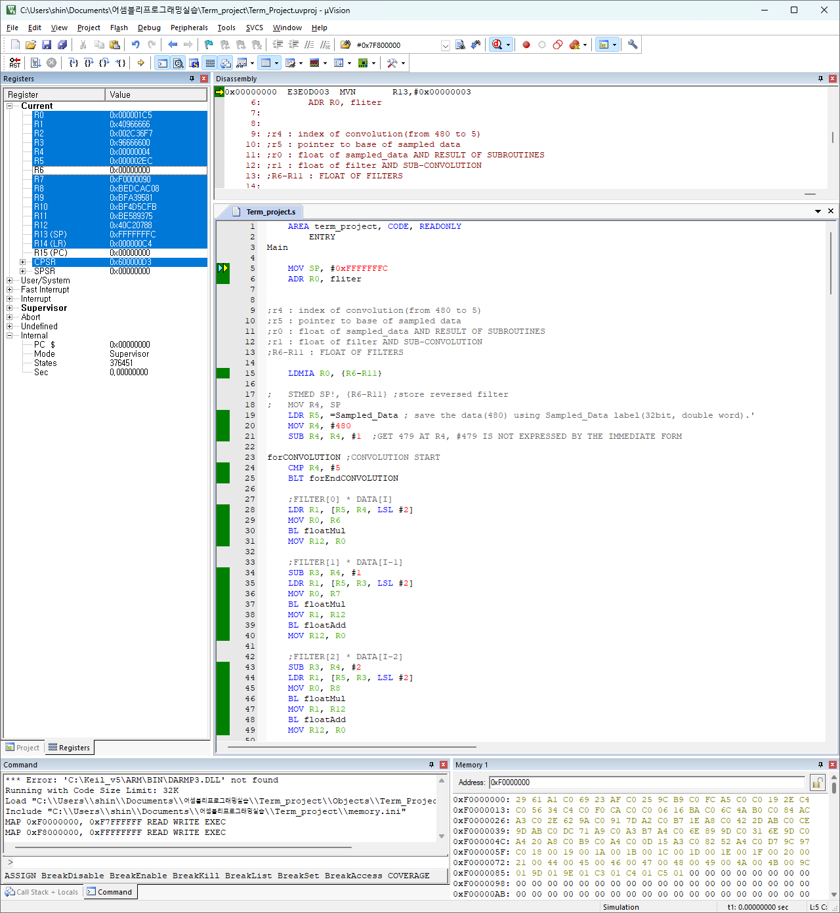
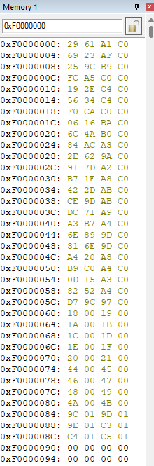

# Floating-point Convolution in ARM Assembly

별도의 고수준 언어 연산 없이 IEEE 754 단정도 부동소수점 덧셈·곱셈 루틴을 ARM Assembly로 작성하고, 이를 이용해 1차원 이산 합성곱을 계산한 프로젝트입니다.

| 항목 | 내용 |
| --- | --- |
| 수업 | 2022학년도 2학기 어셈블리프로그램설계및실습 |
| 입력 | 480개 단정도 실수, 6-tap filter |
| 도구 | ARM Assembly, Keil µVision |
| simulator 설정 | ARM9E-S little-endian, 60 MHz |

## Problem

입력 (x[n])과 길이 6인 filter (h[k])에 대해 다음 합성곱을 계산합니다.

$$
y[n]=\sum_{k=0}^{5}h[k]x[n-k], \qquad 5\le n\le479
$$

filter는 `[1.95, 1.72, -0.431, -1.278, -0.8022, -0.2115]`이며, (y[n]\le-4.7)인 결과와 index를 메모리 `0xF0000000`부터 저장합니다.

## Implementation

- `floatMul`: sign·exponent·mantissa를 분리해 mantissa 곱, exponent 합, sign XOR을 수행
- `floatAdd`: exponent를 정렬한 뒤 mantissa를 더하거나 빼고 결과를 정규화
- main loop: 6개 filter 계수와 입력 구간을 곱해 누산하고 threshold와 비교
- result writer: 조건을 통과한 값과 index를 stack에 모은 뒤 지정 메모리 영역에 각각 기록

단정도 수 (x)는 다음 형태로 분해해 처리했습니다.

$$
x=(-1)^s\times(1.f)_2\times2^{e-127}
$$

## Result

- 보고서 기준 code size는 2,672 bytes입니다.
- threshold 이하의 convolution 결과 24개를 찾았습니다.
- 결과 값은 `0xF0000000`부터, 이어서 대응하는 index를 저장하도록 구성했습니다.

## Scope and Limitations

`floatAdd`는 0 처리와 exponent 정렬 등 일반적인 입력을 고려했지만, `floatMul`은 과제 입력 범위에 맞춰 작성했습니다. 곱셈 결과의 exponent가 표현 범위를 넘는 경우와 IEEE 754의 모든 예외 상태를 처리하지 않으며, 곱셈의 하위 bit는 0 방향으로 절삭합니다.

## Build and Run

1. [`source/more/Term_Project.uvproj`](./source/more/Term_Project.uvproj)를 Keil µVision에서 엽니다.
2. simulator 초기화 시 [`source/more/memory.ini`](./source/more/memory.ini)를 적용해 `0xF0000000` 이후 영역을 mapping합니다.
3. `Term_project.s`를 build하고 debugger에서 실행합니다.
4. Memory window의 `0xF0000000`부터 결과와 index를 확인합니다.

## Files

| 경로 | 설명 |
| --- | --- |
| [`source/Term_project.s`](./source/Term_project.s) | 최종 ARM Assembly source |
| [`source/memory.ini`](./source/memory.ini) | 결과 메모리 영역 simulator mapping |
| [`Assembly_Project_2019202053.pdf`](./Assembly_Project_2019202053.pdf) | 알고리즘과 debugger 결과 보고서 |
