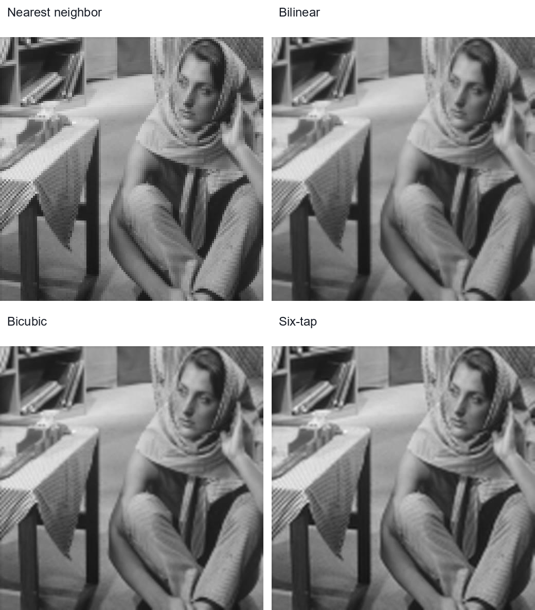

# Image Interpolation Methods

128×128 grayscale 영상을 512×512로 확대하는 네 가지 보간법을 C로 직접 구현하고, 같은 데이터셋에서 PSNR과 결과 영상을 비교한 프로젝트입니다.

| 항목 | 내용 |
| --- | --- |
| 수업 | 수치해석 |
| 입력 / 출력 | YUV400 8-bit RAW, 128×128 → 512×512 |
| 구현 방법 | Nearest neighbor, bilinear, bicubic, six-tap |
| 개발 환경 | Visual Studio, Platform Toolset v143 |

## Visual Comparison

Barbara 영상에 네 방법을 순서대로 적용한 보고서 결과입니다.

## Formulation

### Nearest Neighbor

확대 배율이 4일 때 원본 픽셀을 가장 가까운 4×4 출력 영역에 복제합니다.

$$
\hat I(4i+r,4j+s)=I(i,j), \qquad r,s\in\{0,1,2,3\}
$$

### Bilinear Interpolation

두 축에서 선형 보간을 차례로 수행합니다. 정규화 좌표 (u,v\in[0,1])에 대해 출력은 네 이웃의 가중합입니다.

$$
\hat I(u,v)=(1-u)(1-v)I_{00}+u(1-v)I_{10}+(1-u)vI_{01}+uvI_{11}
$$

### Bicubic Interpolation

축마다 네 점을 사용해 3차 Lagrange 다항식을 계산하고, 행 방향 보간 후 열 방향 보간을 수행합니다.

$$
p(x)=\sum_{k=0}^{3}y_kL_k(x), \qquad
L_k(x)=\prod_{\substack{m=0\\m\ne k}}^{3}\frac{x-x_m}{x_k-x_m}
$$

계산값이 8-bit 범위를 벗어나면 0~255로 clipping합니다.

### Six-tap Interpolation

보고서에서 주어진 6-tap 필터를 정수 계수로 적용했습니다.

$$
\hat x_{n+\frac12}=\frac{x_{n-2}-5x_{n-1}+20x_n+20x_{n+1}-5x_{n+2}+x_{n+3}}{32}
$$

코드에서는 나눗셈 전에 31을 더하고 5-bit right shift를 사용합니다. 필터로 생성하지 않은 중간 위치는 선형 보간으로 채웁니다.

## PSNR Results

$$
\operatorname{PSNR}=10\log_{10}\left(\frac{255^2}{\operatorname{MSE}}\right)
$$

| 영상 | Nearest neighbor | Bilinear | Bicubic | Six-tap |
| --- | ---: | ---: | ---: | ---: |
| Barbara | 22.010410 dB | 22.852111 dB | 23.213232 dB | 23.411390 dB |
| Couple | 23.434371 dB | 24.436955 dB | 24.746116 dB | 25.162733 dB |
| Lena | 25.798532 dB | 28.013244 dB | 28.851131 dB | 29.298919 dB |

이 데이터셋과 구현 조건에서는 세 영상 모두 six-tap의 PSNR이 가장 높았습니다. 데이터셋 밖의 영상이나 다른 배율에 대한 결과는 측정하지 않았습니다.

## Implementation Decisions

- Bilinear의 분모가 2의 거듭제곱인 연산은 정수 덧셈과 bit shift로 처리했습니다.
- Bicubic은 `double`로 Lagrange 행렬 연산을 수행하고 최종 값을 반올림·clipping했습니다.
- 경계에서는 같은 값을 반복하거나 대칭 값을 사용하는 padding을 방법별로 적용했습니다.
- 각 결과를 ground truth와 비교해 MSE와 PSNR을 계산했습니다.

## Build and Run

1. [`source/interpolation.sln`](./source/interpolation.sln)을 Visual Studio에서 엽니다.
2. 작업 디렉터리를 `source`로 둡니다.
3. `source/dataset/result` 디렉터리를 만든 뒤 실행합니다.
4. 각 영상·방법의 RAW 결과와 PSNR이 생성됩니다.

## Files

| 경로 | 설명 |
| --- | --- |
| [`source/main.c`](./source/main.c) | 네 보간법, RAW I/O, PSNR 계산 |
| [`source/dataset/lr`](./source/dataset/lr/) | 128×128 입력 영상 |
| [`source/dataset/gt`](./source/dataset/gt/) | 512×512 ground truth |
| [`NM-HW02-2019202053-ver2.pdf`](./NM-HW02-2019202053-ver2.pdf) | 알고리즘 설명과 실험 결과 보고서 |
