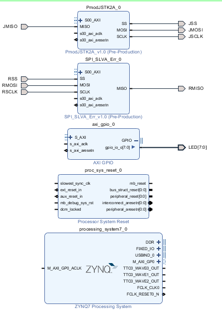
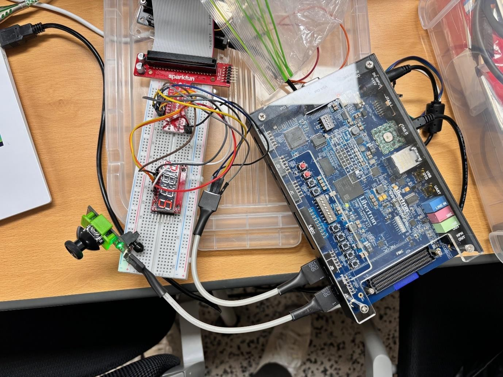

# ZYNQ-Jetson Nano SPI Communication

ZYNQ 보드에서 읽은 조이스틱 데이터를 SPI로 Jetson Nano에 전달하고, Nano가 만든 제어 신호로 보드 LED·조이스틱 LED·7-segment를 구동한 개인 프로젝트입니다.

| 항목 | 내용 |
| --- | --- |
| 수업 | 2023학년도 마이크로프로세서 아키텍처 실습 |
| 담당 범위 | AXI 주소 연결, ZYNQ 펌웨어, Nano 제어 프로그램, `spidev` 수정, 통합 테스트 |
| 환경 | ZYNQ starter board, Jetson Nano, Pmod JSTK2, 7-segment |
| 기술 | AXI, SPI, GPIO, C, Python, Linux device driver |

## System Overview



1. ZYNQ가 AXI를 통해 조이스틱의 X/Y 좌표와 버튼 상태를 읽습니다.
2. ZYNQ가 32-bit 데이터를 SPI로 Nano에 전달합니다.
3. Nano가 방향·버튼을 판별하고 LED 제어 프레임을 ZYNQ에 돌려보냅니다.
4. Nano는 별도 SPI 채널의 7-segment에 X/Y 좌표를 출력합니다.

### AXI Address Map

| 모듈 | 주소 |
| --- | --- |
| Nano 연결 SPI slave | `0x43C0_0000` |
| Pmod JSTK2 | `0x43C1_0000` |
| AXI GPIO | `0x4120_0000` |

## What I Implemented

- `helloworld.c`: 조이스틱 데이터를 Nano로 전달하고, 반환된 프레임을 LED 출력으로 변환하는 ZYNQ 펌웨어
- `ddrv_jstk.py`: `spidev`로 두 SPI 채널을 제어하고 좌표·버튼을 LED 및 7-segment 데이터로 변환하는 Nano 프로그램
- `spidev.c`: 수신 데이터 반전 문제를 보정하도록 수정한 Linux SPI character driver
- Vivado block design과 address map을 구성하고 실제 보드에서 방향·버튼·표시 장치 동작을 확인

## Problem Solving

### Inverted RX Data

FPGA 측 SPI slave에서 모든 수신 비트가 반전되었습니다. HDL을 수정하지 않는 조건에서 `spidev_read()`가 user space로 복사하기 전에 각 바이트를 다시 반전하도록 처리했습니다.

```c
for (i = 0; i < status; i++)
    spidev->rx_buffer[i] = ~(spidev->rx_buffer[i]);
```

### Ignored Chip Enable

SPI slave가 CE 상태와 관계없이 다른 장치용 트래픽까지 읽어 LED 데이터가 섞였습니다. Nano→ZYNQ 프레임의 상위 16 bit를 `0xFFFF`로 고정하고, ZYNQ에서는 이 값이 없는 프레임을 버리도록 구분했습니다.

```c
if ((var & 0xFFFF0000) != 0xFFFF0000)
    continue;
```

7-segment 데이터는 각 자리의 0~9만 사용하므로 이 sentinel과 겹치지 않습니다.

## Verification



- 조이스틱 상·하·좌·우 이동에 따라 좌표 로그와 ZYNQ LED가 변하는 것을 확인했습니다.
- 두 버튼 입력에 따라 버튼 비트와 LED 출력이 바뀌는 것을 확인했습니다.
- 7-segment에 X/Y 좌표의 십 단위 값을 4자리로 출력했습니다.
- 조이스틱 LED의 주기적 점멸을 확인했습니다.

## Files and Reproduction Notes

| 경로 | 설명 |
| --- | --- |
| [`source/helloworld.c`](./source/helloworld.c) | Xilinx SDK용 ZYNQ application |
| [`source/ddrv_jstk.py`](./source/ddrv_jstk.py) | Nano의 Python SPI application |
| [`source/spidev.c`](./source/spidev.c) | 비트 반전을 보정한 driver source |
| [`2019202053_신윤석_Lab14.pdf`](./2019202053_신윤석_Lab14.pdf) | 회로 구성과 실기 검증을 기록한 보고서 |

저장소에는 최종 Vivado hardware project와 bitstream이 포함되어 있지 않습니다. 동일 환경에서 다시 실행하려면 보고서의 block design·pin constraint를 바탕으로 hardware를 구성하고, Nano에 `python3-spidev`를 준비한 뒤 각 source를 해당 보드에 배포해야 합니다.

