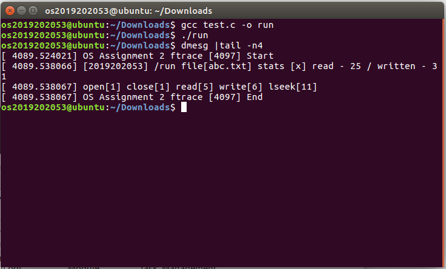

# System Call I/O Tracer

Linux 4.19.67에 사용자 정의 system call을 추가하고, 두 커널 모듈이 특정 PID의 `open`, `read`, `write`, `lseek`, `close` 호출을 기록하도록 구현한 운영체제 과제입니다.

> 여기서 `ftrace`는 Linux의 function tracer 기능이 아니라, 과제에서 새로 정의한 336번 system call의 이름입니다.

| 항목 | 내용 |
| --- | --- |
| 환경 | Linux kernel 4.19.67, x86-64 |
| 구현 언어 | C |
| kernel 변경 | syscall table 등록, prototype 추가, built-in source 연결 |
| module | trace session 관리 모듈 + 5개 I/O syscall hooking 모듈 |

## Design

1. system call 336에 `ftrace(pid)`를 등록합니다.
2. `ftracehooking` 모듈이 첫 호출의 PID를 저장하고 counter를 초기화합니다.
3. `iotracehooking` 모듈이 다섯 I/O system call을 감싸고, `current->pid`가 대상 PID일 때만 통계를 갱신합니다.
4. `ftrace(0)` 호출 시 파일명, 호출 횟수, 읽고 쓴 byte를 kernel log에 출력합니다.
5. 모듈 제거 시 원래 syscall function pointer를 복구합니다.

두 모듈은 `EXPORT_SYMBOL`로 대상 PID와 통계 변수를 공유합니다.

## Verification

보고서의 test program은 `abc.txt`에 대해 다음 결과를 만들었습니다.

| 항목 | 결과 |
| --- | ---: |
| `open` / `close` | 1 / 1회 |
| `read` | 5회, 25 bytes |
| `write` | 6회, 31 bytes |
| `lseek` | 11회 |

이 값이 test program의 호출 구조와 일치하고, 같은 내용이 `dmesg`에 기록되는 것을 확인했습니다.

## Source Layout

| 경로 | 설명 |
| --- | --- |
| [`linux-4.19.67/ftrace/ftrace.c`](./linux-4.19.67/ftrace/ftrace.c) | built-in system call 원형 |
| [`linux-4.19.67/ftrace/ftracehooking.c`](./linux-4.19.67/ftrace/ftracehooking.c) | trace 시작·종료와 결과 출력 |
| [`linux-4.19.67/ftrace/iotracehooking.c`](./linux-4.19.67/ftrace/iotracehooking.c) | 5개 I/O syscall wrapper |
| [`linux-4.19.67/ftrace/ftracehooking.h`](./linux-4.19.67/ftrace/ftracehooking.h) | page write-protection 전환 helper |
| [`linux-4.19.67/arch/x86/entry/syscalls/syscall_64.tbl`](./linux-4.19.67/arch/x86/entry/syscalls/syscall_64.tbl) | 336번 syscall 등록본 |
| [`linux-4.19.67/include/linux/syscalls.h`](./linux-4.19.67/include/linux/syscalls.h) | prototype 추가본 |

## Reproduction Notes

이 구현은 Linux 4.19.67의 `sys_call_table`을 직접 교체하는 방식에 의존합니다. 최신 kernel과 호환되지 않을 수 있고 잘못 적재하면 system이 불안정해질 수 있으므로 전용 VM에서 확인하는 것을 전제로 합니다.

1. 저장된 `syscall_64.tbl`, `syscalls.h`, top-level `Makefile`, `ftrace/` 내용을 Linux 4.19.67 source tree의 같은 위치에 반영합니다.
2. kernel을 build·설치한 뒤 해당 kernel로 부팅합니다.
3. `ftrace/Makefile`로 두 module을 build합니다.
4. `ftracehooking` 다음 `iotracehooking` 순으로 적재합니다.
5. 대상 PID로 trace를 시작하고 I/O 수행 후 0으로 종료한 뒤 kernel log를 확인합니다.

전체 수행 화면과 과정은 [`os_2_2019202053_B.pdf`](./os_2_2019202053_B.pdf)에 기록되어 있습니다.
