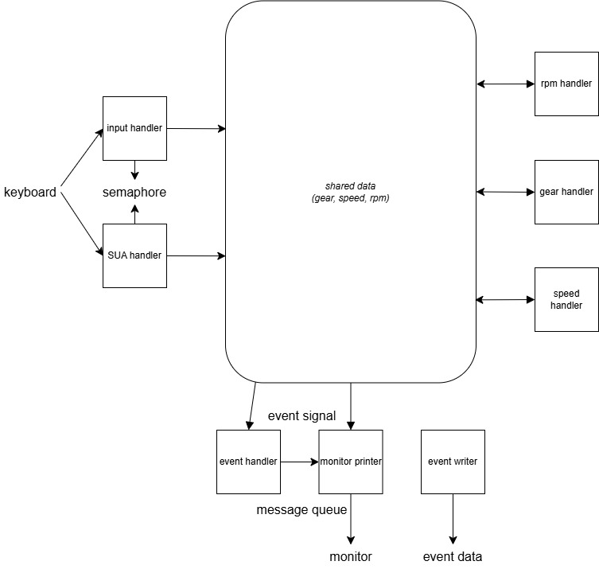

# introduce

이 프로젝트는 24학년도 1학기 김태석 교수님의 "임베디드 소프트웨어 설계" 과목의 개인 프로젝트로 진행하게되었습니다.

RTOS(Real Time Operating System)인 uC/OS를 이용하여 자동차의 속도를 주기적으로 계산하고 계산된 속도와 현재 자동차의 속도가 다를 경우 긴급 제동 신호를 모니터로 내보냅니다.

# 의의와 한계

* 의의
** 실시간으로(주기적으로) 태스크가 실행된다는 특성을 이용해서 미분-적분 관계에 있는 가속도 - 속도 관계를 차분과 합으로 나타냈습니다.

* 한계
** 해당 모듈에서 사용하는 속도는 사실 자동차 바퀴 등의 센서에서 읽어오면 해당 계산을 할 필요가 없습니다.

* 결론
** RTOS의 실시간성 특성을 이용하는 방법을 배웠고, 추후 실무에서 차량 센서 데이터를 가공할 때 RTOS를 이용할 때 적용하겠습니다.

# 자료구조 설계 및 Task 설계

## 자료구조



shared data에 각 모듈이 접근합니다. 기본적으로 input handler와 SUA handler는 세마포어를 얻고 shared data에 접근합니다. 각 핸들러는 동일한 데이터를 변경하기에 서로 데이터를 덮어 씌우는 일이 없도록 하기 위함입니다.

event handler는 데이터를 읽고 있다가 엑셀 페달이 밟히지 않았는데도 속도가 증가한다면(디젤엔진 런어웨이) 이를 감지하여 메시지 큐에 데이터를 작성합니다. 모니터에 출력하는 태스크가 메시지 큐에서 해당 메시지를 확인하면 모니터에 급발진이라고 출력해줍니다. 실제 모듈이라면, GPIO 등을 통해 데이터를 출력하는 태스크를 정의해서 위험 신호를 출력하게 할 수 있을 것입니다.

## 태스크와 우선순위

## 데이터 입력 태스크

* `void inputhandler(void* data)`
> 사용자로부터 키보드 입력을 받아 내부 입력관련 변수를 조작하는 태스크입니다.

* `void SUAhandler(void* data)`
> 사용자로부터 키보드 입력을 받아 급발진 상황을 조절하는 태스크입니다.

데이터 입력 태스크는 우선순위가 낮습니다. 키보드로부터의 데이터를 평상시 폴링하다가 다른 데이터 연산 태스크가 수행되는 시기에는 작동하지 않습니다.

## 데이터 조작 태스크

* `void gearhandler(void* data)`
> 입력 기어에 맞춰서 기어를 변속하고 현재 기어에 맞춰서 rpm을 속도로 변환해 줍니다.

* `void rpmhandler(void* data)`
> 입력 엑셀 신호에 맞춰서 rpm을 높이고 rpm 속도에 맞춰서 저항으로 인한 rpm 감소폭을 반영합니다.

* `void speedhandler(void* data)`
> 입력 브레이크 신호에 맞춰서 속도를 감소시키고 속도에 맞춰서 rpm을 조정합니다.

데이터 조작 태스크는 가장 우선순위가 높은 태스크입니다. 높은 우선순위를 통해 실행 주기성(실시간성)을 보장받고, 이를 통해 정확한 합 계산을 통해 raw데이터를 적분된 데이터로 전환합니다.

## 출력 관련 태스크

* `void eventhandler(void* data);`
> 급발진이 발생했는지 확인하는 태스크입니다. 악셀을 밟지 않았음에도 속도가 늘어난다면 메시지 큐를 이용해서 데이터를 전송합니다.

* `void monitorPrinter(void* data)`
> monitor printer는 프로젝트 내부 변수의 정보를 형식에 맞춰서 모니터에 출력해 주는 함수입니다.

데이터 조작 태스크는 우선순위가 데이터 조작 태스크보다는 낮고 데이터 입력 태스크보다는 높습니다. 데이터 조작이 끝나면 이를 출력하는 의도를 가지고 해당 우선순위를 부여했습니다.

# calculation

이번 프로젝트에서는 자동화 수동 변속기(디젤엔진) 차량의 속도를 계산합니다.

자동차 구조 특성에 맞춰 rpm을 기준으로 속도가 기어박스에 의해 결정이 되고, 브레이크를 통해 속도가 줄어들게 됩니다.

rpm은 두 단계를 거쳐 결정 됩니다.

1. 가속 페달
> rpm 변수를 올려 간접적으로 속도 값을 올립니다.
> ```cpp
> rpm += (5 - gear) * accel_pad * 3
> ```
> 위와 같이 엑셀 패달 전개 값과 기어 단수에 비례해서 rpm이 상향 조정됩니다.
> ```cpp
> rpm -= (short)round(exp((double)rpm / 1000)) + gear_ratio
> ```
> 반대로 엑셀 패달을 밟고 있지 않을 경우 엔진 브레이크에 의해 rpm이 자동으로 하향 조정됩니다.

2. 기어 박스

> 기어 박스는 rpm을 가속도 값으로 바꿔줍니다. 다음 표를 기준으로 기어비를 설정했습니다.
> |단|기준 rpm|속도(km/h)|기어비(속도/rpm)|
> |-|---------|---------|---------------|
> |1단|2000|15|0.0075|
> |2단|2000|30|0.015|
> |3단|2000|50|0.025|
> |4단|2000|80|0.04|
> |5단|2000|115|0.0575|
> ```cpp
> speed = rpm * gear_ratio[gear]
> ```
> 위와 같이 기어비를 참조해서 rpm을 로 변환합니다.

3. 브레이크

> 브레이크를 통해 속도를 선형으로 감소시킵니다.
> ```cpp
> speed -= break_pad
> ```
> 브레이크 패달의 전개가 클수록 속도도 빠르게 줄어듭니다.

4. 동기화

> 브레이크로 줄어든 속력에 맞춰 rpm을 동기화 해줍니다.
> ```cpp
> rpm = speed / gear_ratio[gear];
> ```