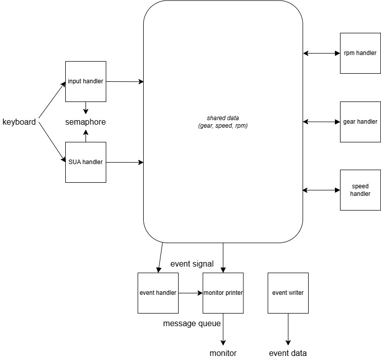

# uC/OS-II Car Speed Simulator

uC/OS-II의 태스크, 세마포어, 메시지 큐를 사용해 차량의 기어·RPM·속도를 주기적으로 계산하고 비정상 가속 상황을 감지하는 콘솔 시뮬레이터입니다.

| 항목 | 내용 |
| --- | --- |
| 수업 | 2024학년도 1학기 임베디드 소프트웨어 설계 |
| 형태 | 개인 프로젝트 |
| 환경 | uC/OS-II Win32 port, Microsoft C compiler |
| 핵심 기능 | 주기적 상태 계산, 입력 동기화, 비정상 가속 감지, 긴급 제동 신호 |

## Task and Data Flow

공유 상태는 `speed`, `rpm`, `gear_state`, 페달 입력으로 구성됩니다. 두 입력 태스크는 세마포어로 입력 변경 구간을 보호하고, 비정상 가속 이벤트는 메시지 큐를 통해 출력 태스크에 전달합니다.

| 우선순위 | 태스크 | 역할 |
| ---: | --- | --- |
| 10 | `rpmhandler` | 가속 페달과 엔진 저항을 RPM에 반영 |
| 11 | `gearhandler` | 자동·수동 변속과 기어비에 따른 속도 계산 |
| 12 | `speedhandler` | 제동량을 속도에 반영하고 RPM 동기화 |
| 19 | `eventhandler` | 비정상 가속 조건을 연속 3회 확인 |
| 20 | `monitorPrinter` | 차량 상태와 경고 메시지 출력 |
| 29 | `SUAhandler` | 테스트용 비정상 가속 상황 입력 |
| 30 | `inputhandler` | 페달과 기어 키 입력 처리 |

uC/OS-II에서는 숫자가 작은 우선순위가 먼저 실행됩니다. 계산 태스크를 입력·출력 태스크보다 높은 우선순위로 두고 각 태스크에 `OSTimeDly()`를 적용했습니다.

## Calculation Model

기어비 $g_k$, 가속 페달 입력 $a$, 브레이크 입력 $b$에 대해 코드의 계산은 다음 형태입니다.

$$
v_t = rpm_t \cdot g_k
$$

$$
rpm_{t+1}=rpm_t+3(5-k)a-round(e^{rpm_t/1000})-g_k
$$

$$
v_{t+1}=v_t-b, \quad rpm_{t+1}=\frac{v_{t+1}}{g_k}
$$

속도 계산 후 음수는 0으로, RPM은 최소 600으로 제한합니다. 자동 변속은 페달 입력별 RPM 상한과 1,000 RPM 하한을 기준으로 동작하고, 수동 모드에서는 변속 후 RPM 범위를 확인합니다.

## Event Handling

가속 페달 입력이 0인데 속도가 연속 세 번 증가하면 비정상 가속으로 판정합니다. 이때 `eventWriter()`가 브레이크 입력을 최댓값 9로 바꾸고, 메시지 큐에 이벤트를 넣어 화면에 `Emergency break opened!`를 표시합니다.

## Controls

| 입력 | 동작 |
| --- | --- |
| `T` / `G` | 가속 페달 증가 / 감소 |
| `R` / `F` | 브레이크 증가 / 감소 |
| `7`, `Y`, `H`, `N` | P, R, N, D 선택 |
| `J` / `M` | 수동 기어 상승 / 하강 |
| `1` / `2` | 비정상 가속 시작 / 종료 |
| `Esc` | 종료 |

## Build and Run

[`source/makefile`](./source/makefile)은 uC/OS-II Win32 port가 `C:\SOFTWARE\uCOS-II`에 설치된 환경과 Microsoft `cl` compiler를 기준으로 작성되어 있습니다.

1. `UCOS_SRC`, `UCOS_PORT_SRC`를 실제 uC/OS-II 경로에 맞춥니다.
2. Visual Studio Developer Command Prompt에서 `source` 디렉터리의 makefile을 실행합니다.
3. 생성된 `main.exe`를 실행하고 위 키로 상태를 변경합니다.

이 프로젝트는 실제 차량 센서나 제어기를 연결하지 않은 교육용 시뮬레이터입니다. 속도와 RPM은 단순화한 수식으로 계산하므로 실제 차량 동역학을 표현하지 않습니다.

## Files

| 경로 | 설명 |
| --- | --- |
| [`source/main.c`](./source/main.c) | 태스크, 공유 상태, 이벤트 처리 구현 |
| [`source/os_cfg.h`](./source/os_cfg.h) | uC/OS-II 기능 설정 |
| [`source/makefile`](./source/makefile) | Win32 port 빌드 설정 |
